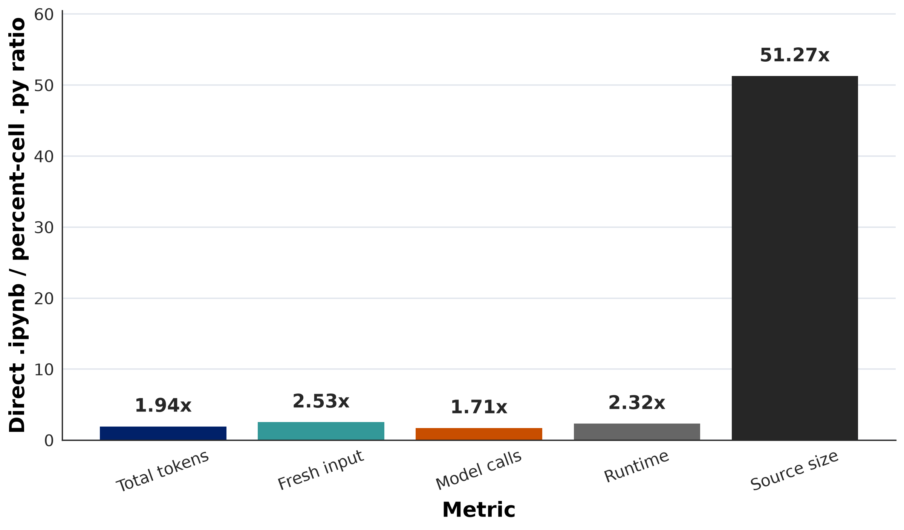
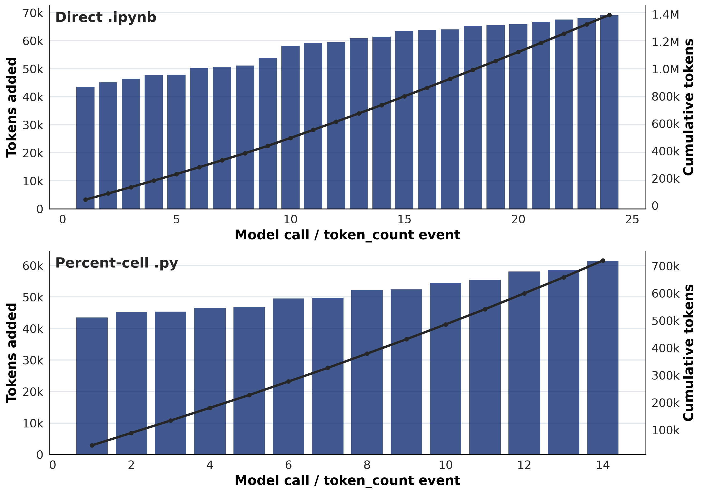
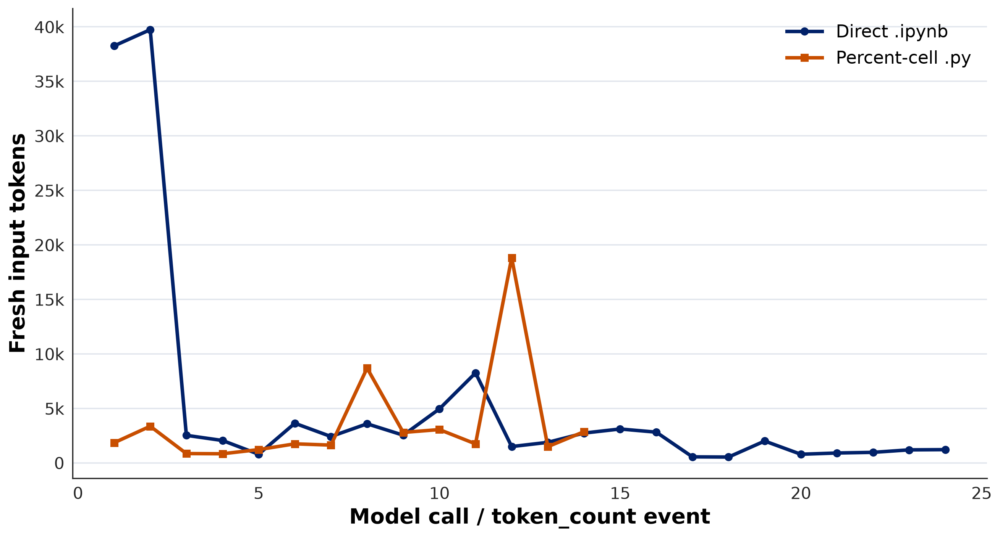
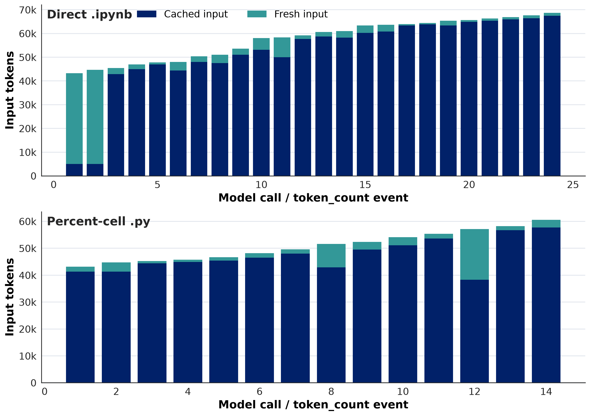
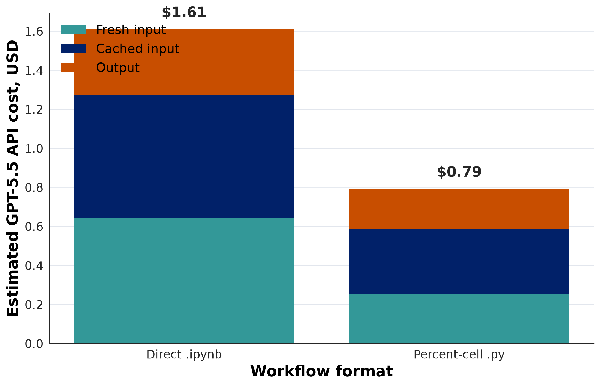

# Notebook vs. Percent-Cell Python for Coding Agents

## Executive Summary

This experiment compared two coding-agent workflows for the same small data-analysis task:

- **Direct notebook workflow:** the agent edited an existing `.ipynb`, executed it, inspected notebook cell outputs, and wrote final interpretation back into the notebook.
- **Percent-cell Python workflow:** the agent edited an existing VS Code/Jupyter-style `.py` file with `# %%` cells, executed it, inspected terminal and saved output artifacts, and wrote final interpretation in the source file.

The task, data, analysis question, project rules, and output requirements were intentionally parallel. The goal was not to benchmark the human-facing analysis result; both agents reached the same substantive conclusion. The goal was to measure how much agent work the file format and workflow induced.

The result was clear for this task: the direct notebook workflow was heavier.

| Metric | Direct `.ipynb` | Percent-cell `.py` | Notebook / `.py` |
|---|---:|---:|---:|
| Total task tokens | 1,395,748 | 719,688 | 1.94x |
| Fresh/non-cached input tokens | 129,036 | 51,000 | 2.53x |
| Observed GPT-5.5 API-equivalent cost | $1.61 | $0.79 | 2.03x |
| Model calls | 24 | 14 | 1.71x |
| Runtime | 8m 30s | 3m 40s | 2.32x |
| Final source artifact tokens | 84,753 | 1,653 | 51.27x |



The main explanation is not that the notebook agent had to write more output text. The larger session footprint came from the notebook workflow requiring more model calls and more repeated context around notebook structure, notebook execution state, and notebook output extraction. A notebook is both source code and saved execution record; the agent had to manage both. The percent-cell `.py` workflow kept source and generated artifacts separate, which gave the agent a smaller and simpler working surface.

The observed cost calculation is useful for describing this run, but it should not be treated as a clean standalone workflow-cost estimate. The percent-cell worker appears to have inherited a warm prompt cache from the earlier notebook worker because the two prompts shared a large prefix.

The strongest practical recommendation from this experiment is:

> For agent-assisted analysis, prefer percent-cell `.py` files plus saved CSV/PNG/Markdown artifacts unless the notebook itself is the required deliverable.

This recommendation should be read as evidence from one controlled task, not a universal law. But the mechanism is plausible and visible in the trace: direct notebook editing created more calls, more inspection steps, more execution-state handling, and a much larger durable source artifact.

## Procedure

Two starter files were created:

- `agent-format-experiment/direct-notebook-agent/analysis-notebook.ipynb`
- `agent-format-experiment/direct-py-cell-agent/analysis-cells.py`

Two worker subagents were then assigned the same analysis task:

> How have Seattle Public Library physical vs. digital checkout totals changed across complete years, and which recent complete year shows the largest digital share?

Both agents were required to:

- read `seattle-public-library/README.md` first for schema and row meaning
- use only `seattle-public-library/combined_checkout_totals_by_month_usageclass.csv`
- use complete years only, requiring 12 months for both physical and digital usage classes
- write explicit, student-readable pandas code
- save at least one chart and one CSV table
- inspect outputs before writing interpretation
- create a `run-log.md` documenting commands and inspected outputs

The workflows differed only in the assigned durable analysis format:

- Carson worked directly in the `.ipynb` using notebook-aware editing and `nbconvert` execution.
- Confucius worked directly in the percent-cell `.py` using `.venv/bin/python` execution.

The raw Codex session logs were copied into the report directory so this analysis can be audited without depending on `~/.codex`:

- `raw-logs/notebook-carson-019ec69e-fa32-7283-b6c6-fc26f2e1d8d8.jsonl`
- `raw-logs/percent-cell-confucius-019ec69f-3714-7170-8901-7d4a0f4d47bb.jsonl`

Token totals come from the final cumulative `total_token_usage` fields in the Codex JSONL logs. The verification file confirms that summing each event's `last_token_usage` exactly reproduces the final cumulative totals for both sessions.

## Findings

### 1. The Notebook Workflow Had a Larger Session Footprint

The notebook worker used 1,395,748 total tokens; the percent-cell worker used 719,688. Total tokens are useful as a session-footprint metric: they show how much model-call traffic accumulated during the task.



Total tokens should not be interpreted as unique text. Later model calls carry repeated context, and much of that repeated context may be counted as cached input. But total tokens still matter for allocation-style accounting and for understanding how much context the task carried through repeated model calls.

### 2. Fresh Context Was Also Higher for the Notebook Workflow

Fresh/non-cached input is the better metric when the question is closer to "how much newly processed input context did this task introduce?" On this metric, the notebook workflow was also larger:

- Carson notebook: 129,036 fresh input tokens
- Confucius percent-cell `.py`: 51,000 fresh input tokens

That is a 2.53x difference.



This matters because cached input is not the same as fresh input. Cached input is still counted in total tokens and still appears in the session telemetry, but under GPT-5.5 API pricing it is much cheaper than fresh input. Fresh input plus output is probably closer to what many people intuitively mean when they worry about "new model work," although it is still not a direct energy measurement.

### 3. Caching Behavior Is Visible but Should Not Be Overinterpreted

The input-composition trace shows that cached and fresh input change from call to call. This is expected: prompt caching can apply to reusable prefixes rather than the entire prompt. The model can receive a prompt that is partly cached and partly fresh.



One important early-call pattern: Carson's first two calls had only about 4,992 cached input tokens, then call 3 jumped to 42,880 cached input tokens. That suggests the long shared prefix was not mostly counted as cached until the third model call. Confucius had much more cached input from its first call. This early difference should not be treated as a notebook-vs-`.py` result by itself; it may reflect cache warmup or shared-prefix behavior outside the file-format question.

The more stable comparison is cumulative: across the task, the notebook workflow had more total input, more fresh input, and more model calls.

### 4. Observed Cost Was Higher, but Cache Order Confounds the Exact Ratio

Using GPT-5.5 rates:

- fresh input: $5.00 per 1M tokens
- cached input: $0.50 per 1M tokens
- output: $30.00 per 1M tokens

the observed API-equivalent costs from the logged cache classification were:

- Carson notebook: $1.611532
- Confucius percent-cell `.py`: $0.793720



The cost formula was:

```text
fresh_input = input_tokens - cached_input_tokens

cost =
  fresh_input * 5.00 / 1,000,000
  + cached_input_tokens * 0.50 / 1,000,000
  + output_tokens * 30.00 / 1,000,000
```

Reasoning-output tokens were not added separately because the session telemetry's `total_tokens` equals `input_tokens + output_tokens`.

However, this is not a clean workflow-cost comparison. Confucius's first call had 43,193 input tokens, of which 41,344 were already classified as cached. Carson's first call had a similar input size, 43,241 tokens, but only 4,992 were cached. That strongly suggests the second worker benefited from a prompt cache warmed by the first worker's similar prompt.

Sensitivity checks:

| Scenario | Notebook cost | Percent-cell cost | Notebook / `.py` |
|---|---:|---:|---:|
| Observed telemetry | $1.61 | $0.79 | 2.03x |
| Exclude first call from both sessions | $1.41 | $0.75 | 1.87x |
| Exclude first two calls from both sessions | $1.20 | $0.70 | 1.71x |
| Normalize percent-cell first call to Carson's first-call cache hit | $1.61 | $0.96 | 1.68x |
| Normalize percent-cell first two calls to Carson's early cache hit | $1.61 | $1.12 | 1.44x |

The cost direction is consistent across these checks, but the exact cost ratio is sensitive to cache handling. For that reason, cost should be described as a sensitivity result rather than primary causal evidence.

### 5. The Notebook Needed More Calls Because It Was Managing Source and Execution State

The notebook worker made 24 model calls and 36 classified tool calls. The percent-cell worker made 14 model calls and 22 classified tool calls.

Notebook-specific activity included:

- 6 direct notebook edits
- 6 notebook structure-validation calls
- 4 notebook execution calls
- 11 notebook output-extraction calls

The percent-cell workflow had a simpler loop:

- edit source
- execute source
- inspect terminal output or saved artifacts
- patch source again if needed

The notebook workflow had to preserve and inspect a JSON document that included source cells, metadata, execution counts, display outputs, stream outputs, and saved image data references. That made the agent repeatedly inspect notebook structure and cell outputs. In other words, direct notebook editing made the agent manage the analysis source and the saved execution record at the same time.

### 6. The Notebook Artifact Was Much Larger

The final `.ipynb` source artifact was 84,753 tokens. The final percent-cell `.py` source artifact was 1,653 tokens.

This does not mean every future agent would read the entire notebook every time. But it does mean the durable working file is far larger, and follow-up agents may need to inspect or patch a much heavier source artifact. Saved notebook outputs are useful for humans, but they can be expensive context for coding agents.

### 7. Both Agents Reached the Same Analysis Result

The workflow difference did not change the substantive answer:

- complete years were 2006-2025
- digital checkouts rose sharply over the period
- physical checkouts declined from 2006 to 2025
- among recent complete years 2021-2025, 2024 had the largest digital share at about 64.5%

That makes the format comparison cleaner: the extra notebook cost did not buy a different analytical result in this task.

## Conclusion

This experiment supports using percent-cell `.py` files as the default durable analysis format for coding-agent work. The percent-cell workflow preserved the important interactive-analysis properties: cells, rerunnable code, saved outputs, and human-readable interpretation. It did so with fewer model calls, fewer tokens, shorter runtime, and a much smaller source artifact. The observed cost was also lower, but the exact cost ratio is confounded by cross-session prompt caching.

The notebook workflow remains appropriate when the notebook itself is the required deliverable, when notebook-native output state is part of the product, or when collaborators specifically need `.ipynb` semantics. But for agent-assisted analysis where the goal is efficient iteration and reproducible artifacts, percent-cell Python plus saved outputs is the cleaner default.

The most defensible claim is not "never use notebooks." It is:

> Direct notebook editing can impose substantial overhead on coding agents because the agent must manage both code and notebook execution state. Percent-cell Python keeps the working source smaller and separates code from output artifacts, which can reduce agent token use. Cost likely moves in the same direction, but this experiment's exact cost ratio should be treated as cache-sensitive.

## Appendix

### A. Reproducible Artifacts

Primary report artifacts:

- `index.html`: interactive Plotly version of this report
- `report.md`: Markdown narrative report
- `scripts/build_report.py`: standard-library script that regenerates `index.html`

Raw logs:

- `raw-logs/notebook-carson-019ec69e-fa32-7283-b6c6-fc26f2e1d8d8.jsonl`
- `raw-logs/percent-cell-confucius-019ec69f-3714-7170-8901-7d4a0f4d47bb.jsonl`

Final worker artifacts:

- `source-artifacts/analysis-notebook.ipynb`
- `source-artifacts/analysis-cells.py`

Generated data:

- `data/direct-comparison-token-usage.csv`
- `data/direct-comparison-api-costs.csv`
- `data/direct-comparison-tool-call-summary.csv`
- `data/direct-comparison-token-event-checks.csv`
- `data/model-call-token-events.csv`
- `data/direct-comparison-agent-prompts.md`

Report figures:

- `assets/report-summary-ratios.png`
- `assets/report-session-footprint.png`
- `assets/report-input-composition.png`
- `assets/report-fresh-context-comparison.png`
- `assets/report-cost-components.png`

### B. Reproduction Commands

Run from this standalone folder:

```bash
python scripts/build_report.py
```

No third-party Python packages are required to rebuild the HTML report. Plotly is vendored at `assets/plotly-2.35.2.min.js`, and the script reads the included CSV files in `data/`.

The included raw logs are the audit source for the token totals. The included CSV files are the cleaned, report-ready extracts from those logs so the HTML can be rebuilt without access to the original `~/.codex` directory or the larger working repository.

### C. Exact Worker Prompts

The exact worker prompts are preserved in `data/direct-comparison-agent-prompts.md`. The shared injected project context was identical across both worker sessions. The task-specific prompts differed only in the assigned artifact and workflow mechanics: direct `.ipynb` editing for Carson, percent-cell `.py` editing for Confucius.

### D. Notes on Token Interpretation

`total_tokens` is cumulative accounting across model calls. It is not unique text.

`input_tokens` includes both cached and non-cached input:

```text
input_tokens = cached_input_tokens + non_cached_input_tokens
```

`total_tokens` for a call is:

```text
total_tokens = input_tokens + output_tokens
```

Cached input is still counted in total tokens, but it is classified as reusable prefix context and priced at the cached-input rate. Non-cached input is the fresh portion of the prompt for that call. Output is generated model text and is priced separately.

For energy or compute interpretation, neither raw total tokens nor fresh input alone is perfect. Total tokens can overstate new work because cached input is included; fresh input can understate total work because cached input and output are not free. API-equivalent cost is a practical weighted proxy, not a direct energy measurement.

### E. Confucius Event 12

Confucius event 12 had high fresh input: 18,821 non-cached input tokens. This was not caused by reading a large CSV. The CSV inspections happened earlier and were small: the first eight CSV rows were about 161 original output tokens, and the last six rows were about 113 original output tokens.

Event 12 was the call that wrote `run-log.md` with `apply_patch`. The patch output itself was tiny, but the cache hit was worse on that call: cached input dropped to 38,272 compared with 53,632 on the prior call. The event is best interpreted as a cache-classification spike plus a larger generation step for the run log, not as evidence of a large CSV read.
